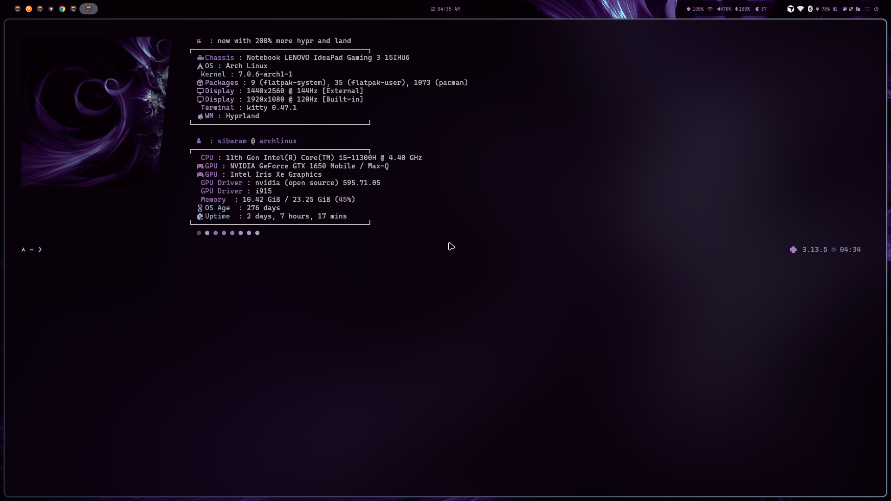

<div align="center">

# 🌊 halcyon

**A calm, polished Linux rice — my personal [Hyprland](https://hypr.land) desktop built on the [HyDE](https://github.com/HyDE-Project/HyDE) framework.**


**🚀 Installing from scratch? → [Full guide: Arch + HyDE + halcyon](docs/INSTALL-ARCH.md)**

</div>

---

## 📑 Table of contents

- [About](#-about)
- [Screenshots](#-screenshots)
- [What's included](#-whats-included)
- [Requirements](#-requirements)
- [Installation](#-installation)
  - [Full install guide (Arch from scratch) ↗](docs/INSTALL-ARCH.md)
- [Updating](#-updating)
- [Uninstall / restore](#-uninstall--restore)
- [Repository structure](#-repository-structure)
- [Customization](#-customization)
- [Troubleshooting](#-troubleshooting)
- [Credits](#-credits)
- [Support](#-support)
- [License](#-license)

---

## 📖 About

This repository is my personal collection of configuration files ("dotfiles") for
a Hyprland-based Wayland desktop on Arch Linux. It is built **on top of**
[HyDE](https://github.com/HyDE-Project/HyDE) — HyDE provides the base framework,
theming engine (`wallbash`) and scripts; this repo layers my personal tweaks on
top (keybindings, window rules, bar layout, prompt, editor, etc.).

Configs are linked into place with a small, dependency-free `install.sh` that uses
symlinks, so once installed you **edit files in this repo and the changes are live**.

> [!IMPORTANT]
> This is **not** a standalone desktop. You must install
> [HyDE](https://github.com/HyDE-Project/HyDE) first; these files extend and
> override it. The large, HyDE-managed `~/.config/hyde/themes/` directory
> (wallpapers + generated theme assets) is intentionally **not** tracked here.

---

## 📸 Screenshots




<sub>Hyprland · Waybar · kitty · fastfetch — Obsidian-Purple theme</sub>

> More shots coming soon (lockscreen, app launcher).

---

## 📦 What's included

| Path | Tool | What it configures |
|------|------|--------------------|
| `.config/hypr` | [Hyprland](https://hypr.land) | Window manager: keybindings, window rules, workspaces, animations, monitors, `hyprlock`, `hypridle`, shaders, workflows |
| `.config/waybar` | [Waybar](https://github.com/Alexays/Waybar) | Status bar — layout, styles, modules |
| `.config/rofi` | [Rofi](https://github.com/davatorium/rofi) | App launcher / menus theme |
| `.config/kitty` | [Kitty](https://sw.kovidgoyal.net/kitty/) | Terminal emulator |
| `.config/dunst` | [Dunst](https://github.com/dunst-project/dunst) | Notification daemon |
| `.config/wlogout` | [wlogout](https://github.com/ArtsyMacaw/wlogout) | Power / logout menu + icons |
| `.config/nvim` | [Neovim](https://neovim.io) | Editor config (LazyVim-based) |
| `.config/cava` | [CAVA](https://github.com/karlstav/cava) | Audio visualizer + shaders/themes |
| `.config/fastfetch` | [Fastfetch](https://github.com/fastfetch-cli/fastfetch) | System info on shell start + logos |
| `.config/starship` | [Starship](https://starship.rs) | Shell prompt |
| `.config/hyde/config.toml` | [HyDE](https://github.com/HyDE-Project/HyDE) | Per-user HyDE settings |
| `.config/hyde/wallbash` | HyDE wallbash | Color-template scripts for theming apps from the wallpaper |

---

## ✅ Requirements

- **Arch Linux** (or an Arch-based distro)
- **[Hyprland](https://hypr.land) ≥ 0.55** (Wayland)
- **[HyDE](https://github.com/HyDE-Project/HyDE)** installed and working
- `git`, `bash`
- The apps you intend to use:

```bash
sudo pacman -S hyprland waybar rofi kitty dunst neovim cava fastfetch starship
# wlogout is usually from the AUR:
yay -S wlogout
```

> If you installed HyDE, most of these are already present.

### Compatibility

| | |
|---|---|
| ✅ **Supported** | Arch Linux & Arch-based (EndeavourOS, CachyOS, Garuda, …) with HyDE |
| ⚠️ **Not out of the box** | Debian/Ubuntu/Fedora/openSUSE (HyDE is Arch-focused), or any non-Hyprland / X11 setup |
| 🖥️ **Session** | Wayland only |

After installing, review two machine-specific files: `hypr/monitors.conf` (your display
layout) and `hypr/nvidia.conf` (only on NVIDIA GPUs).

> 🆕 **Brand new to Arch?** Start here: **[Full Arch + HyDE + halcyon install guide →](docs/INSTALL-ARCH.md)**
> (bootable USB, Wi-Fi over CLI, `archinstall`, minimal packages, HyDE, then halcyon).

---

## 🚀 Installation

> [!TIP]
> **Starting from a blank machine?** Follow the complete, beginner-friendly
> **[Arch + HyDE + halcyon install guide →](docs/INSTALL-ARCH.md)** (bootable USB,
> Wi‑Fi on the CLI, `archinstall` walkthrough, HyDE, then halcyon). The steps below
> assume you already have a working HyDE desktop.

> [!IMPORTANT]
> **When to do this:** clone and run the installer **only after you have a working
> HyDE desktop** — i.e. as the *last* step, not on a bare system. The correct order is:
>
> 1. Install **Arch Linux** (base system, working boot + internet).
> 2. Install **[HyDE](https://github.com/HyDE-Project/HyDE)** and **reboot into Hyprland at least once** so HyDE generates its files under `~/.config`.
> 3. *(Optional)* install any [extra apps](#-requirements) you want (`wlogout`, etc.).
> 4. **Then** clone this repo and run `./install.sh` to layer `halcyon` on top.
>
> Running the installer before HyDE exists will back up empty/missing configs and
> some apps won't have anything to theme yet.

### 1. Install HyDE first (if you haven't)

Follow the official guide: <https://github.com/HyDE-Project/HyDE>

```bash
pacman -S --needed git base-devel
git clone --depth 1 https://github.com/HyDE-Project/HyDE ~/HyDE
cd ~/HyDE/Scripts
./install.sh
```

### 2. Clone this repo

```bash
git clone https://github.com/sm60786/halcyon-rice ~/halcyon
cd ~/halcyon
```

### 3. Preview the changes (recommended)

The dry run shows exactly what will be linked or backed up — **nothing is changed**:

```bash
./install.sh --dry-run
```

### 4. Apply

```bash
./install.sh              # symlink configs only
# or, to also install the extra tools halcyon uses:
./install.sh --packages
```

The **`--packages`** flag installs the packages listed in `packages.txt` (pacman) and
`aur.txt` (AUR, via `paru`/`yay`) — the tools on top of a HyDE base that halcyon relies
on (`yazi`, `yt-dlp`, `mpv`, `swappy`, `yt-x`, …). Preview it with
`./install.sh --packages --dry-run`.

Any existing config is **moved to a timestamped backup** at
`~/.dotfiles-backup/<YYYYMMDD-HHMMSS>/` before a symlink is created, so nothing is
lost. The script is **idempotent** — safe to re-run anytime.

#### Installer options

| Flag | Effect |
|------|--------|
| _(none)_ | Link everything, backing up anything in the way |
| `--dry-run` | Show planned actions, change nothing |
| `--force` | Overwrite existing symlinks **without** creating a backup |
| `-h`, `--help` | Show usage |

### 5. Reload

```bash
hyprctl reload          # reload Hyprland
killall -SIGUSR2 waybar # reload Waybar (or just relog)
```

Log out and back in for everything (prompt, fastfetch, etc.) to take full effect.

---

## 🔄 Updating

Because the configs are **symlinked**, you just edit files normally — your live
desktop and this repo are the same files. To save and publish changes:

```bash
cd ~/halcyon
git add -A
git commit -m "tweak: describe what changed"
git push
```

To pull updates on another machine:

```bash
cd ~/halcyon
git pull
./install.sh   # re-link anything new
```

---

## ♻️ Uninstall / restore

The installer never deletes — it backs up. To restore a previous setup, remove the
symlinks and move your backup back, e.g.:

```bash
rm ~/.config/hypr   # removes the symlink only
mv ~/.dotfiles-backup/<timestamp>/.config/hypr ~/.config/hypr
```

---

## 🗂 Repository structure

```
halcyon/
├── .config/
│   ├── hypr/         # Hyprland (wm, lock, idle, animations, rules…)
│   ├── waybar/       # status bar
│   ├── rofi/         # launcher
│   ├── kitty/        # terminal
│   ├── dunst/        # notifications
│   ├── wlogout/      # power menu
│   ├── nvim/         # editor
│   ├── cava/         # audio visualizer
│   ├── fastfetch/    # system info
│   ├── starship/     # prompt
│   └── hyde/         # config.toml + wallbash (themes/ excluded)
├── install.sh        # symlink installer (dry-run / force / backups / packages)
├── packages.txt      # extra pacman packages (install.sh --packages)
├── aur.txt           # extra AUR packages (install.sh --packages)
├── README.md
├── LICENSE           # GPL-3.0
└── .gitignore
```

---

## 🎨 Customization

- **Keybindings:** `.config/hypr/keybindings.conf`
- **Window rules:** `.config/hypr/windowrules.conf`
- **Monitors:** `.config/hypr/monitors.conf` (machine-specific — edit per device)
- **Personal Hyprland overrides:** `.config/hypr/userprefs.conf`
- **Bar layout/style:** `.config/waybar/`
- **Prompt:** `.config/starship/starship.toml`
- **Themes/wallpapers:** managed by HyDE — use `hyde-shell` / the HyDE theme picker
  rather than editing `~/.config/hyde/themes/` by hand.

---

## 🩹 Troubleshooting

**`config option <dwindle:pseudotile> does not exist`**
Removed in Hyprland 0.55 (it did nothing). Delete the line; pseudotile is now
per-window via the `pseudo` dispatcher.

**`Invalid dispatcher, requested "togglesplit" does not exist`**
The `togglesplit`/`swapsplit` dispatchers were removed in Hyprland 0.54+. Use
`layoutmsg` instead:

```ini
bindd = $mainMod, J, toggle split, layoutmsg, togglesplit
```

**Monitors are wrong after install**
`monitors.conf` is machine-specific. Edit it (or use `nwg-displays`) for your setup.

---

## 🙏 Credits

- [**HyDE-Project/HyDE**](https://github.com/HyDE-Project/HyDE) — the base framework,
  theming engine, and many of the scripts/configs this repo builds on (GPL-3.0).
- The [Hyprland](https://hypr.land) project and community.
- Authors of every tool listed in [What's included](#-whats-included).

---

## 💜 Support

If this setup helped you, consider starring the repo or sponsoring my work:

- ⭐ Star this repository
- 💖 [Sponsor me on GitHub](https://github.com/sponsors/sm60786)

[](https://github.com/sponsors/sm60786)

---

## 📜 License

Distributed under the **GNU General Public License v3.0** — see [LICENSE](./LICENSE).

This repository contains and derives from [HyDE](https://github.com/HyDE-Project/HyDE),
which is licensed under GPL-3.0. As a derivative work, this repository is also
distributed under GPL-3.0. You are free to use, study, modify, and redistribute it
under the same license.
